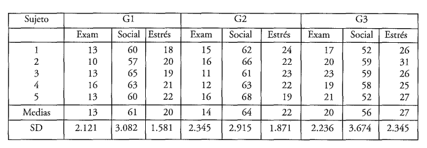
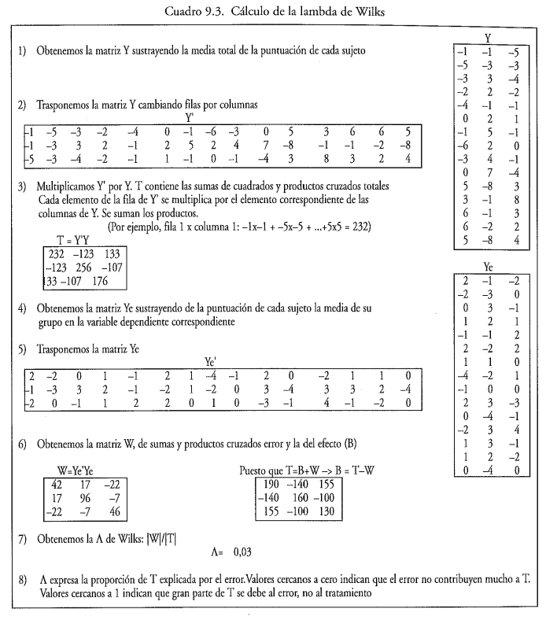

# Calculos en R del Ejemplo de Catena

## Ejemplo de Catena

Supongamos que hemos aplicado el diseño que hemos presentado más arriba en el que se trataba de comprobar la eficacia diferencial de tres terapias de ansiedad y en el que se proponía medir a cada sujeto del estudio tres variables dependientes: 

- Ansiedad ante los exámenes
- Ansiedad social 
- Ansiedad ante eventos estresantes

Cada terapia es aplicada a un grupo diferente de sujetos. Llamaremos a las terapias $G_1$, $G_2$ y $G_3$, y a las variables dependientes $Y_1$ $Y_2$ y $Y_3$. Supongamos que los datos obtenidos tras la aplicación de los tratamientos a sujetos por grupo han sido:





## Calculos en R
### Declaramos los arreglos necesarios
```{r}
# Mediciones de Ansiedad ante los exámenes
examen <- c(13, 10, 13, 16, 13,   # G1
            15, 16, 11, 12, 16,   # G2
            17, 20, 23, 19, 21)   # G3

# Mediciones de Ansidad social
social <- c(60, 57, 65, 63, 60,   # G1
            62, 66, 61, 63, 68,   # G2
            52, 59, 59, 58, 52)   # G3

# Mediciones de Ansiedad ante eventos estresantes 
estres <- c(18, 20, 19, 21, 22,   # G1
            24, 22, 23, 22, 19,   # G2
            26, 31, 29, 25, 27)   # G3    
```

### 1) Obtenemos la matriz Y sustrayendo la media total de la puntuación de cada sujeto

```{r}
# Restamos la media de cada arreglo
x <- round(examen - mean(examen))
y <- round(social - mean(social))
z <- round(estres - mean(estres))

# Concatenamos para construir la matriz Y
Y <- cbind(x, y, z)
Y
```

### 2) Trasponemos la matriz Y cambiando filas por columnas
```{r}
Yt = t(Y)
Yt
```

### 3) Multiplicamos Y' por Y
```{r}
T = Yt %*% Y
T
```

### 4) Obtenemos la matriz Ye sustrayendo de la puntuación de cada sujeto la media de su grupo en la variable dependiente correspondiente
```{r}
# Examenes
x[1:5] <- round(x[1:5] - mean(x[1:5])) # G1
x[6:10] <- round(x[6:10] - mean(x[6:10])) # G2
x[11:15] <- round(x[11:15] - mean(x[11:15])) # G3

# Social
y[1:5] <- round(y[1:5] - mean(y[1:5])) # G1
y[6:10] <- round(y[6:10] - mean(y[6:10])) # G2
y[11:15] <- round(y[11:15] - mean(y[11:15])) # G3

# Estres
z[1:5] <- round(z[1:5] - mean(z[1:5])) # G1
z[6:10] <- round(z[6:10] - mean(z[6:10])) # G2
z[11:15] <- round(z[11:15] - mean(z[11:15])) # G3

# Concatenamos para construir la matriz Ye
Ye <- cbind(x, y, z)
Ye

```

### 5) Trasponemos la matriz Ye 
```{r}
Yet = t(Ye)
Yet
```

### 6) Obtenemos la matriz W
```{r}
W = Yet %*% Ye
W

# Puesto que T=B+W -> B=T-W
B = T - W
B
```

### 7) Obtenemos la $\lambda$ de Wilks: |W|/|T|
```{r}
lw = det(W)/det(T)
lw
```
